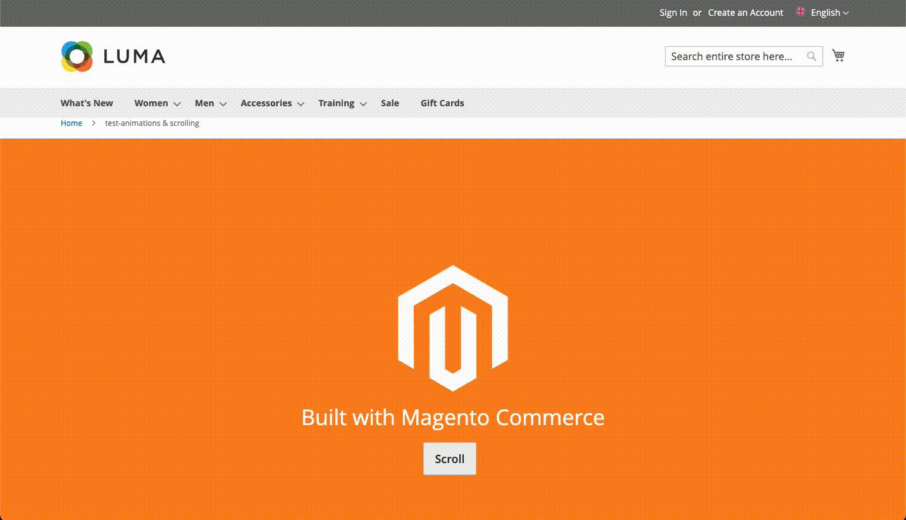

# Add In Page Anchors for Magento Page Builder

Adding a simple Anchor for Page Builder. This makes it easier for people to link buttons and links to specific parts of the page, and includes a smooth scroll to the Anchor.

## Installation

Composer instructions to go here.....

## Usage

Once installed, it will show within your Page Builder CMS interface under Elements.

Drag the element on to screen, within a row or column, and simply type your identifier. Use the same identifier in a button or link with the # in-front of it to target that specific part of the page.

## To do

* Test thoroughly
* Make smooth scroll optional/adjustable
* Tidy up preview/placeholder so it doesn't show the #

## Boring stuff

This code is provided "as is" and not intended for production use. It is created to improve my own personal workflow and is not endoresed or supported by myself, my employer or anyone else associated with the code. If you use this, you do so at your own risk, and with full knowledge of what you're doing.